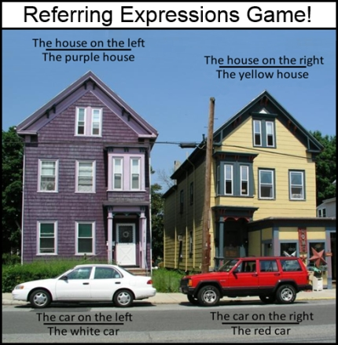

# referit-game-code-app

<p align="left">
  
</p>

### Pre-requisites
* ubuntu: 16.04
* mongo: 4.0.9
* node: 10.16.0
* npm: 6.9.0

### Install
* run ```npm install``` or install all the packages in package.json by ```npm install xxx --save```
* prepare ```NewestOrder.txt``` saving all image (target object or stuff) files to be collected
* prepare ```LabeledImages.txt``` for canned game, which we will use as faked game if no pair of players were found.
* prepare ```ImagesP2```, ```ImagesP4```, and ```PNGImages``` in public. Note, ```ImagesP2``` saves original images (no highlight), ```ImagesP4``` saves targetted object images (with highlighted polygon), and ```PNGImages``` saves foreground/background 0-1 images. Samples are saved in ```public/samples```

### Function
* This games supports two modes: player-and-AI and player-and-player. 
* MTurk collection (TODO)


### How to run
* shut down firewall
* start Mongodb: ```sudo service mongod start'''
* run node: ```node server.js'''
